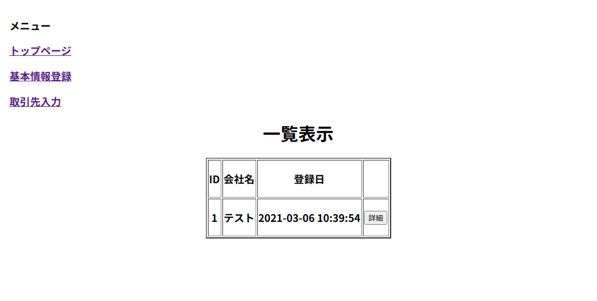
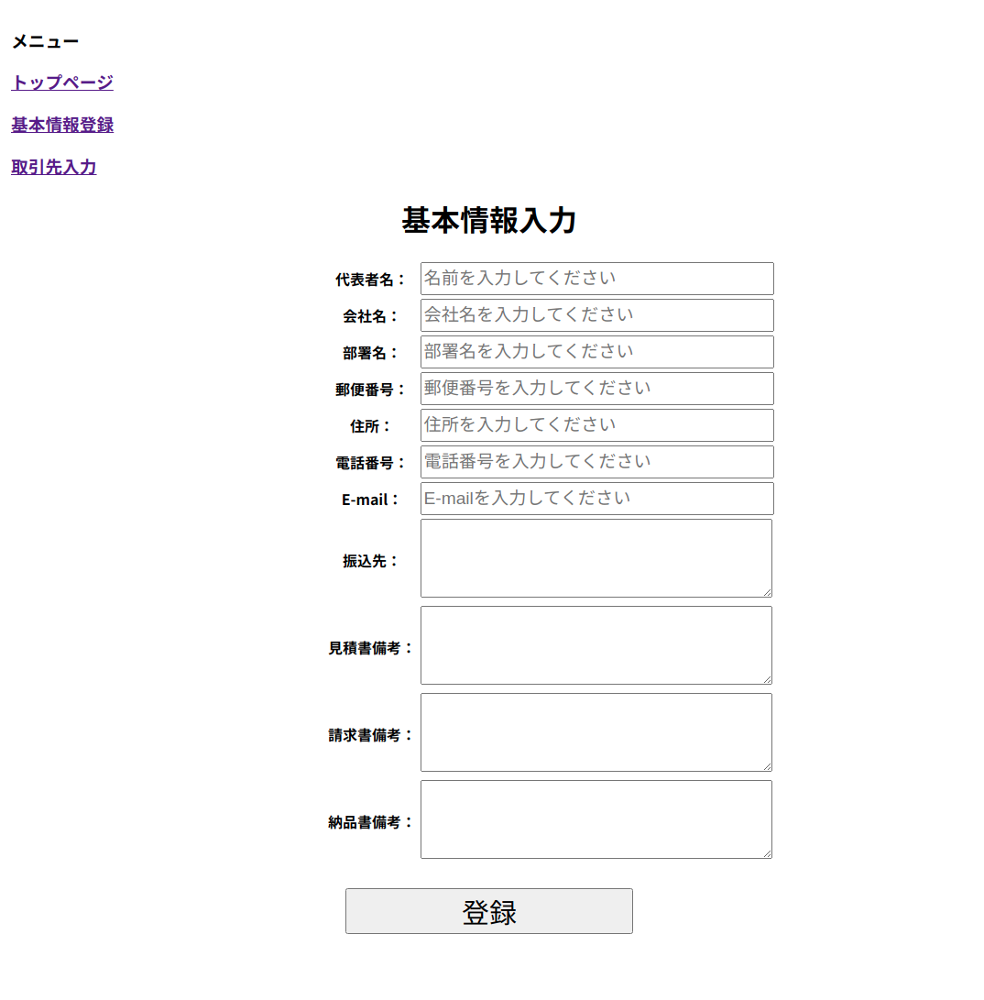
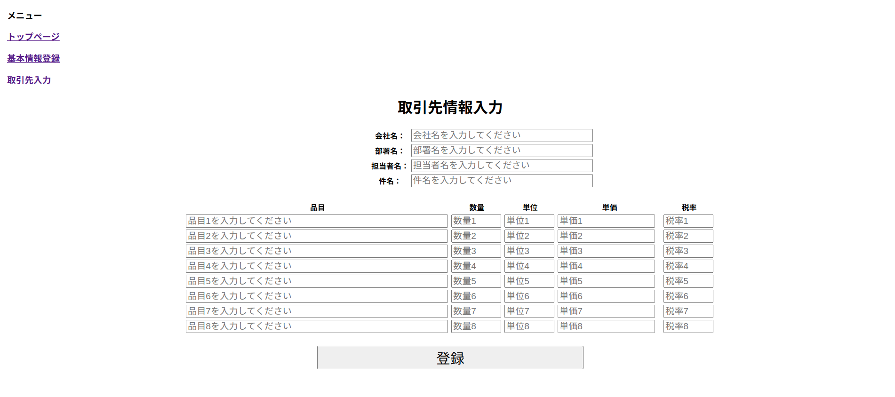
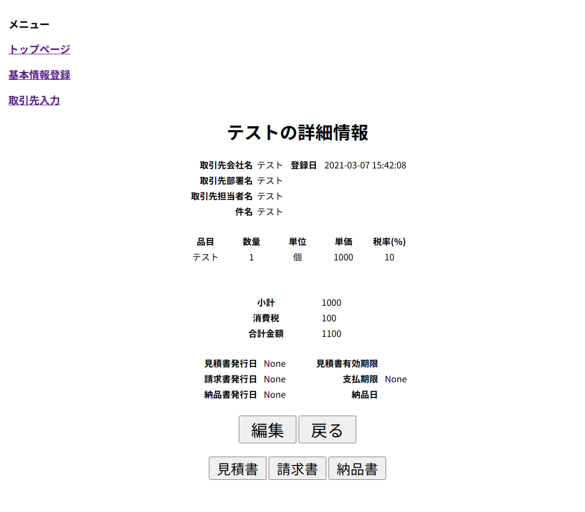
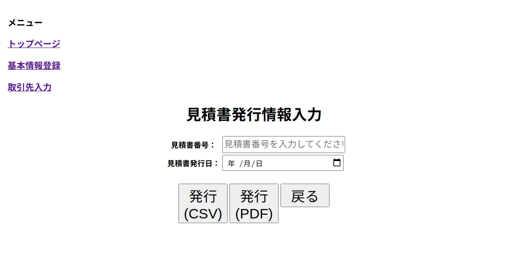
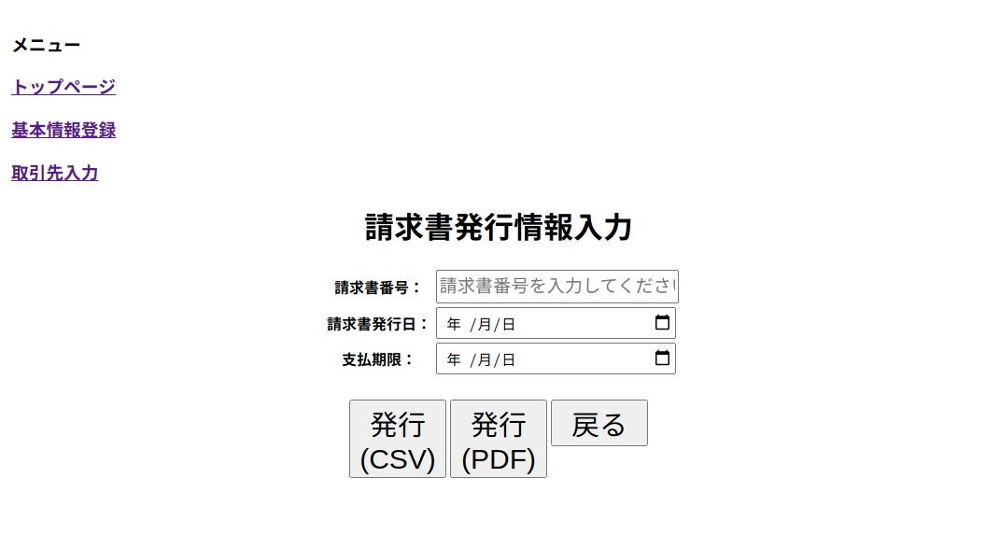
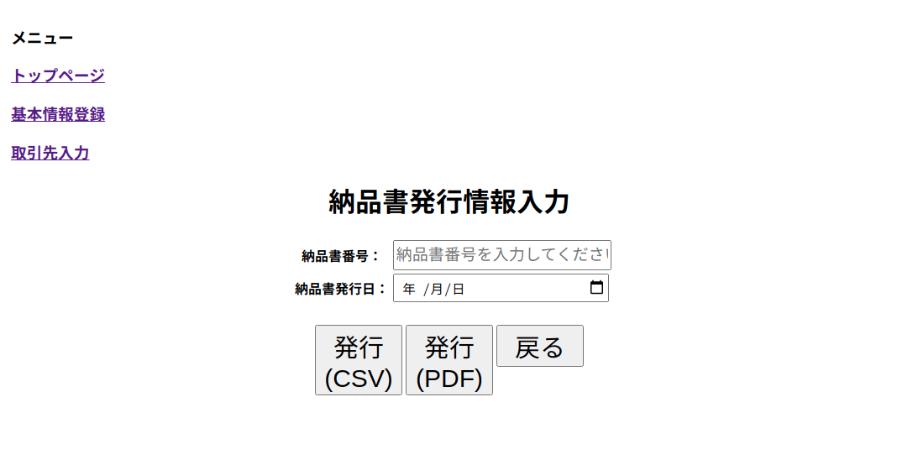

# 帳票生成webアプリ
帳票を自動作成するwebアプリのサンプルコード

## 概要
* 自社の基本情報の登録・編集  
* 取引先情報の登録・編集  
* 入力情報をもとに見積書・請求書・納品書を作成  
* 見積書・請求書・納品書はテンプレート(xlsxファイル)を用いる
* 帳票の出力はcsv or pdf形式  

## 機能
* 自社の会社名、振込先など必要な情報の登録と編集  
* 取引先の会社名、品目などの登録と編集  
* 取引先情報の詳細表示  
* 選択した取引先の見積書・請求書・納品書の作成 
* csv or pdf形式でのファイル出力  
（ただし、pdfはlibreofficeのコマンドを用いてため、インストールが必要）  

## version
* python 3.8.0  
* Flask 1.1.2  
* Flask-SQLAlchemy 2.4.4  
* openpyxl 3.0.6  
* SQLAlchemy 1.3.32  
  
## 実行方法
### 方法1 (pipでインストール)
1. run.pyのhost, portを変更する(外部公開する場合)  
app.run(debug=False, host='127.0.0.1', port=8008)  
2. `python setup sdist`\
3. `pip install -e .`\
4. `myapp`\

### 方法2 (pythonで実行)
1. run.pyのhost, portを変更する(外部公開する場合)  
app.run(debug=False, host='127.0.0.1', port=8008)
2. `python install -r requirements.txt`\
3. `python run.py`\

## 画面サンプル
#### トップ画面
* 登録した取引先情報の会社名と登録日の表示  
* 詳細をクリックすることで取引先情報の詳細を表示  

#### 自社の基本情報の入力画面
* 自社の基本情報を入力  

#### 取引先情報の入力画面
* 取引先情報の入力  

  
#### 取引先情報の詳細表示画面
* 取引先情報の詳細表示と編集  
* 出力する帳票の選択  

  
#### 見積書発行画面
* 見積書発行するための番号と発行日の入力  
* 発行するファイル形式（CSV or PDF）の選択  

#### 請求書発行画面
* 請求書発行するための番号と発行日、支払期限の入力  
* 発行するファイル形式（CSV or PDF）の選択  

  
#### 納品書発行画面
* 納品書発行するための番号と発行日の入力  
* 発行するファイル形式（CSV or PDF）の選択  

  